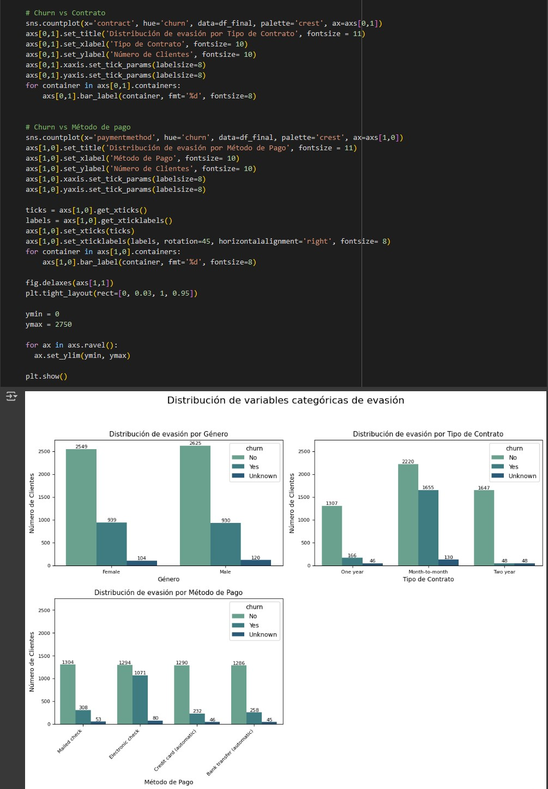

---

# Challenge: AluraStores: análisis de la tienda de menor rendimiento

---

Este es un proyecto de Análisis de datos aplicando teoría básica del uso de python para el análisis de datos tomado del curso de DataScience de Alura Latam, en el que podemos tomar datos de tipo JSON e importarlos para el análisis de los mismos, también con dichos datos tomamos diferentes tipos de análisis, para este caso sobre la información de clientes de una empresa de telecomunicaciones TelecomX en el que surge la necesidad de evaluar los aspectos más relevantes para generar estrategias que promuevan la continuidad de cotractos por parte de los usuarios, ya que se presenta un gran número de evasión o retiro de los mismos en cuanto al uso de sus productos, se toman aspectos claves como: evasión vs género, evasión vs tipo de contrato, evasión vs método de pago, evasión vs total pagado, evasión vs tiempo de contrato, se generan gráficas para una mejor interpretación y análisis del tema en cuestión.

---

### 🚀 Características

1. Extraer datos en formato JSON para análisis con python.

2. Analiza carácterísticas especiales extraídas de los datos obtenidos.

3. Generar gráficos para facilitar la interpretación visual.

4. Dar un panorama de tipo analítico u crítico de la situación para tomar una buena decisón a la problemática dada.

---

### 📂 Estructura del Proyecto

##### 📁 challenge alura store/ 
│── assets/ (Imágenes y otros recursos) 
│── AluraStoreLatam.ipynb (Lógica) 

---

### 🛠 Tecnologías Utilizadas

- Python 3
- Pandas(Librería)
- NumPy(Librería)
- MatplotLib(Librería)
- SeaBorn(Librería)
- Plotly(Librería)
- Colab (google)

---

### 📝 Uso

- Descarga el archivo terminado en extensión .ipynb:

- Abre Colab:  `https://colab.research.google.com/`

- Sube el archivo descargado en el primer paso.

- Ingresa a mirar todo el código y los análisis que se toman del caso para llegar a la conclusión o análisis final

---

### 📜 Licencia

Este proyecto está bajo la licencia MIT. ¡Siéntete libre de usarlo y mejorarlo! 🎉 